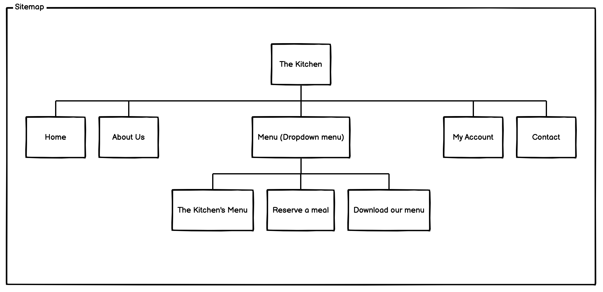

<h1 align="center">User Centric Front-end Development - First Milestone Project</h1>
<h2 align="center">The Kitchen</h2>

View the live website.  [The Kitchen](https://aj27-uk.github.io/User-Centric-Front-End-Development-Milestone-Project-1/home.html)

The project is based on a static front-end using HTML, CSS and Bootstrap technologies and implemented based on user experience design, accessibility and responsiveness. I have designed this website on a bespoke basis for a restaurant called "The Kitchen" situated in Kent. it is a virtual restaurant where people can reserve their meal and deliver it to their doorstep. Their service will promote in this unprecedented time and stand unique. 

<h2 align="center">Contents</h2>
<table align="center">
<tr>
<td>1</td>
<td>User Stories</td>
</tr>
<tr>
<td>2</td>
<td>Sitemap</td>
</tr>
<tr>
<td>3</td>
<td>Wireframe</td>
</tr>
<tr>
<td>4</td>
<td>Design</td>
</tr>
<tr>
<td>5</td>
<td>Features</td>
</tr>
<tr>
<td>6</td>
<td>Technolgies</td>
</tr>
<tr>
<td>7</td>
<td>Testing</td>
</tr>
<tr>
<td>8</td>
<td>Deployment</td>
</tr>
<tr>
<td>9</td>
<td>Credits</td>
</tr>
<tr>
<td>10</td>
<td>Acknowledgements</td>
</tr>
</table>

<h2 align ="center">User Stories</h2>

<h3>First time User</h3>

* As a first-time user, I want to comprehend the website's main purpose and explore more about the restaurant. 
* As a first-time user, I want to be able to navigate throughout the site to find content. 
* As a first-time user, I want to look overview of the restaurant to understand what other users comment on and if the restaurant is suitable for further business. 
* As a first-time user, I want to see a menu to choose a proper meal, and if I need it, I want to download their menu.
* As a first time user, I want to know how to reserve a meal. 
* As a first-time user, I can ask any questions through a contact form if I have any queries.
* As a first time user, I can sign up to make an account with the team. 
* As a first time user, I also want to navigate their social networks in another tab to determine how trusted are they and know more about them from their page updates. 
* As a first time user, I also want to sign up for news and offers so that I can get their new updates by email.
---
<h3>Owner</h3>

* As an owner, I want to make sure all relevant details are updated on my website so that I can expose the business and the people who know about the business locally. 
* As an owner, I want to have a good inspiration when the customer enters the page.
* As an owner, I want the website is attractive and intuitive to potential customers, and it is easy to navigate at any cost.
* As an owner, I want the concept is easy to use and clear.
* As an owner, I want the website to work on all devices.
* As an owner, I want to update our menu and other services so that I can attract new or existing customers.
* As an owner, I want a downloadable menu for the customer to spend less time on the internet to find their meal. 
* As an owner, I want to make sure there is a reservation for a meal online to avoid unnecessary distractions during busy times. 
* As an owner, I want the customers to need contact details to connect with the team.  
* As an owner, I want to sign up to the news and offers so that I can email major updates to the new or existing customers.
* As an owner, I want to specify the restaurant's opening time.
* As an owner, I want the customers can communicate from the site directly to the restaurant team by their email.
* As an owner, I want the customers to need to get a contact form if they have any queries. 
* As an owner, I want the new customer needs to communicate or reserve a meal by signing up section with our website.
* As an owner, I want the existing customer need to communicate or reserve a meal by signing in our website. 
* As an owner, I want my customers to navigate our social networks so that they can get new updates from our service. 
---
<h3>Existing user</h3>

* As an existing user, I want to navigate each page and check to see if there are any new updates.
* As an existing user, I want to sign in and reserve a meal.
* As an existing user, I can look at their menu to choose a meal.
* As an existing user, I want to contact their team if I have any queries.
* As an existing user, I want to navigate their social networks in another tab so that I can get their updates.

<h2 align="center">Sitemap</h2>

At this first stage, I think about what information, pages, features to determine the business goals and user needs and align all the features with the strategy. I wanted a simple design so that the potential customers would not feel overwhelmed by the pages. 
The Kitchen website is a static front end project written in HTML and CSS programming language with main five pages. The top five pages such as:

* HOME
* ABOUT US
* MENU
* MY ACCOUNT 
* CONTACT

The menu page has been divided into three pages as

* THE KITCHEN'S MENU
* RESERVE A MEAL 
* DOWNLOAD OUR MENU 

<h2 align="center">Wireframe</h2>

* HOME 

    Upon entering the home page, the users are greeted with a clear and easily readable navigation bar to go to the page of the user choice. Underneath, there is an image with some text and a "Reserve a meal" call to action button. The user can click on the call to action button or scroll down to find an overview of the restaurant's head chef, a slideshow with images and Contact details, and other helpful links to know more about the restaurant.

    [Homepage-Wireframe](assets/images/wireframe-homepage.png)

* ABOUT US

    Upon entering the about us page, the users are greeted with a clear and easily readable navigation bar to go to the page of the user choice. There is a callout image with the heading "About Us" when scrolling down a more in-depth explanation of the restaurant, testimonials, opening times, contact details and other helpful links to know more about the restaurant.
   
    [AboutUs-Wireframe](assets/images/aboutus-wireframe.png)
 
* MENU

   Upon entering the menu page, the page has been designed with a drop-down menu system with the other three pages: "The Kitchen's menu, Reserve a meal, Download our menu". Different contents separate each page. When entering the menu page of The Kitchen, users are welcomed with a clear and easy-to-read navigation bar to go to the page of their choice. Like the other pages,  a callout image is titled "Menu". As the user scrolls down, potential customers can view a more in-depth description of the current restaurant menu and the prices. Adopting a translucent strategy in this regard will increase customer faithfulness. The footer area contains contact details and other helpful links to learn more about the restaurant when scrolling down. 

   [Menupage-Wireframe](assets/images/)
   
   When entering the reserve a meal page, users are held with a clear and easy-to-read navigation bar to go to the page of their preference. Like the other pages,  a callout image is titled with some text. As the user scrolls down, there is a reservation form for filling to book a meal. The footer area contains contact details and other helpful links. The third page of download our menu allows users to download the menu on their device to spend less time on the internet to find their meal.

   [Reservationpage-Wireframe](assets/images/reservationpage-wireframe.png)

* MY ACCOUNT

    Like other pages, the user will welcome a navigation bar to navigate the pages upon entering the account page. Below that, there is a callout image with a title. When the user scrolls down, the user can find a sign in and sign up form for entering the website as a new customer or existing customer. The footer part of the page gives details of contact info, other essential links like social media links, and the callout button of sign up, reserve a menu and the download menu.

    [MyAccount-Wireframe](assets/images/myaccount-wireframe.png)

* CONTACT
    
    Upon entering the contact page, the users are welcomed with a clear and readily readable navigation bar to proceed to the user preference page. Underneath, there is a callout image with a heading. The contact page gives the contact information such as an address, phone number and email address. When you scroll down, there is a contact form if the user has queries; they can communicate with the restaurant team. A footer with logo, call out button of reserve a meal and download menu and social networks links. 

    [Contactpage-Wireframe](assets/images/contactpage-wireframe.png)

<h2 align="center">Design</h2>

* Colour Scheme

The sensory strategy section of a website is the design of how users see and experience it. I wanted the design to be clean and easy for everyone to access; the colours should not be too dark and give it purity, joy, and creativity. Most of the places I use here are two colours, black and white, which are often associated with luxury and elite trademarks. It is not only used for elegance, sophistication and style. These colours like to communicate with people and target audiences, aiming to gain more traction.
Also, throughout the project, I have used bootstrap colour utilities that support me with styling links and buttons with hover states. I make sure all the contents of the text are visible.

* Typography

Throughout the web, I have used the Cormorant Garamond font family. If the font is not adequately imported to the site, Serif is used as the fallback font for some reason. 

* Imagery

I have used essential images throughout the site to catch the user's attention. Some are created on Canvas, and some are downloaded from Pexels.

* Styling Components

Before starting the development, I listed some styling ideas that encouraged me to simplify things, and I thought they would be helpful for the website. So the features are controlled and straightforward. Therefore, throughout the site, all content was made responsive. It was very successful; I used bootstrap elements such as navigation navbar, dropdown, jumbotron, carousel, cards, forms, buttons, and alerts elsewhere throughout the page.

